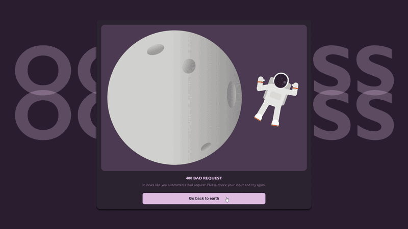

# ASCII Art Web

## Description

ASCII Art Web is a web version of the ASCII Art Generator project.

The application runs an HTTP server written in Go and provides a graphical web interface where users can enter text, select an ASCII art banner style, and generate the corresponding ASCII art.

The user submits the text and selected banner through an HTML form. The Go server processes the request, generates the ASCII art, and displays the result on the webpage.

The application supports three banner styles:

- `standard`
- `shadow`
- `thinkertoy`

---

## Demo



---

## Features

- Generates ASCII art through a web interface.
- Supports three banner styles:
  - Standard
  - Shadow
  - Thinkertoy
- HTML form for submitting text and selecting a banner.
- Supports English alphanumerical text and special characters.
- Supports multiple lines of text.
- Displays the generated ASCII art while preserving spaces and line breaks.
- Includes a Clear button to reset the form.
- Handles invalid requests using appropriate HTTP status codes.
- Supports exporting the ascii art into `.txt`, `html`, and `.png` formats.
- Serves static assets such as images.
- Responsive web interface for different screen sizes.
- Animated visual elements and images effects using CSS.
- Uses only Go standard library packages.
- Can be built and run using Docker.
- Uses a multi-stage Docker build with Alpine Linux for a smaller runetime image.

---

## Project Structure

```text
ascii-art-web-dockerize/
│
├── main/
│   └── main.go
│
├── banners/
│   ├── shadow.txt
│   ├── standard.txt
│   └── thinkertoy.txt
│
├── templates/
│   ├── index.html
│   └── error.html
│
├── assets/
│   ├── astronaut.png
│   ├── moon.png
│   └── player.jpeg
│
├── ascii.go
├── banners.go
├── handlers.go
├── loader.go
├── ascii_test.go
├── Dockerfile
├── .dockerignore
├── go.mod
└── README.md
```

### File Description

| File                   | Description                                                                                                           |
| ---------------------- | --------------------------------------------------------------------------------------------------------------------- |
| `main/main.go`         | Starts the HTTP server and registers the routes.                                                                      |
| `handlers.go`          | Handles GET and POST requests and connects the webpage to the ASCII art generator.                                    |
| `ascii.go`             | Contains the logic for generating ASCII art from the user's text.                                                     |
| `loader.go`            | Loads and parses the ASCII art banner files.                                                                          |
| `banners.go`           | Selects the correct banner based on the user's choice.                                                                |
| `Dockerfile`           | Defines the multi-stage Docker build used to compile and run the application in a lightweight Alpine Linux container. |
| `.dockerignore`        | Specifies files and directories that should not be included in the Docker build context.                              |
| `templates/index.html` | Contains the main webpage, form, banner selection, buttons, and result area.                                          |
| `templates/error.html` | Displays an error page when a request cannot be completed correctly.                                                  |
| `standard.txt`         | Contains the Standard ASCII art banner style.                                                                         |
| `shadow.txt`           | Contains the Shadow ASCII art banner style.                                                                           |
| `thinkertoy.txt`       | Contains the Thinkertoy ASCII art banner style.                                                                       |
| `assets/`              | Contains images used by the web interface.                                                                            |
| `ascii_test.go`        | Contains unit tests for the ASCII art generation and input validation logic.                                          |

---

## Usage

### Running Locally

Run the program from the root `ascii-art-web-dockerize` directory:

go run ./main

Then open the following address in a web browser: `http://localhost:8081`

### Running with Docker

First, build the Docker image from the project root:

`docker image build -f Dockerfile -t ascii-art-web-dockerize .`

Then run the Docker container:

`docker container run -p 8081:8081 --detach --name ascii-art-web-dockerize ascii-art-web-dockerize`

Open the application in a web browser:

http://localhost:8081

The webpage allows the user to:

1. Enter text in the text area.
2. Select a banner style.
3. Click `Generate ASCII Art`.
4. View the generated ASCII art.
5. Click `Export as txt` to export the ascii-art as text file.
6. Click `Export as html` to export the ascii-art as html file.
7. Click `Export as png` to export the ascii-art as png image.
8. Click `Clear` to reset the form.

---

## Docker

The application can be built and run using Docker. The project uses a multi-stage **Dockerfile** to compile the Go application and create a smaller final runtime image using Alpine Linux.

### Why Alpine Linux?

The final Docker image uses **Alpine Linux** because it is a lightweight Linux distribution designed for small container images.

Using Alpine helps:

- Reduce the final Docker image size.
- Reduce the amout of unnecessary software included in the container.
- Make the container faster to build and start.
- Provide a minimal environment containing only what is needed to run the application.

The Go compiler and build tools are only required while building the application, so they are kept in the `golang:1.23-alpine` builder stage and are not included in the final image.

The final image uses:

`FROM alpine:latest`

This creates a smaller runtime environment containing the compiled Go application and the files required by the web application.

### 1. Build the Docker image

From the root `ascii-art-web-dockerize` directory, run:

```bash
docker image build -f Dockerfile -t ascii-art-web-dockerize .
```

The command:

- Builds the Docker image using the `Dockerfile`.
- `-t ascii-art-web-dockerize` gives the image a name.
- `.` uses the current directory as the Docker build context.

### 2. Run the Docker container

Run the container using:

```bash
docker container run -p 8081:8081 --detach --name ascii-art-web-dockerize ascii-art-web-dockerize
```

The application can then be accessed at:

```test
http://localhost:8081
```

### 3. Check the running container

```bash
docker ps -a
```

### 4. stop the container

```bash
docker stop ascii-art-web-dockerize
```

### 5. start the ocntainer again

```bash
docker start ascii-art-web-dockerize
```

### 6. Check the files within the container

```bash
docker exec -it ascii-art-web-dockerize //bin/sh
ls -l
```

### 7. Check metadata

```bash
docker image inspect ascii-art-web-dockerize
```

#### Dockerfile

The Dockerfile uses a **multi-stage build**:

1. Uses `golang:1.23-alpine` as the builder image.
2. Sets `/app` as the working directory.
3. Copies the Go module files and downloads dependencies.
4. Copies the project files into the builder container.
5. Compiles the Go application.
6. Creates a new lightweight Alpine Linux runtime image.
7. Copies the compiled application into the runtime image.
8. Copies the required `templates`, `banners`, and `assets` directories.
9. Exposes port `8081`.
10. Starts the Go server when the container runs.

Using a multi-stage build means that the Go compiler and other build dependencies are not included in the final runtime image, making the final container smaller and more lightweight.

---

## How It Works

### 1. HTTP Server

The application starts an HTTP server using Go's `net/http` package.

The server uses a http.ServeMux to route the incoming requests to the appropriate handlers.

The main routes are:

| Method | Route         | Description                                                               |
| ------ | ------------- | ------------------------------------------------------------------------- |
| `GET`  | `/`           | Displays the main webpage.                                                |
| `POST` | `/ascii-art`  | Receives the user's text and selected banner and generates the ascii art. |
| `GET`  | `/assets/`    | Serves static assets such as images.                                      |
| `POST` | `/export-txt` | Exports the generated ASCII art as a TXT file.                            |
| `POST` | `/export-html` | Exports the generated ASCII art as a HTML file.                            |
| `POST` | `/export-png` | Exports the generated ASCII art as a PNG image.                           |

The server runs on port `8081`.

---

### 2. HTML Form

The main webpage contains a form that sends the user's input to the `/ascii-art` endpoint.

The user enters text using a `<textarea>` and selects a banner using a `<select>` element.

When the user clicks the Generate button, the browser sends a `POST` request containing the selected text and banner.

---

### 3. Receiving and Validating the Form Data

The Go server receives two main form values.

- `text` — The text entered by the user.
- `banner` — The selected banner style.

Before generating the ascii art, the server validates the input.

The application checks that:

- The text is not empty.
- The text contains only supported printable ascii characters.
- The text does not exceed 100 characters.
- The selected banner exists and contains the expected ascii art characters.

Invalid input results in a `400 Bad Request` responses.

---

### 4. Banner Loading

The selected banner file is loaded from the `banner/` directory using the existing ASCII Art banner loader.

Each ASCII character has an 8-line representation.

The banner is stored using the following structure:

```go
type Banner [][]string
```

Each character contains a collection of strings representing its ASCII art rows.

---

### 5. ASCII Art Generation

The application reads each character from the user's input and finds its corresponding representation in the selected banner.

The individual character representations are combined row by row to create the final ASCII art output.

The generated result is then passed to the HTML template.

---

### 6. Displaying the Result

After the ASCII art is generated, the server sends the result back to the HTML template.

The result is displayed inside a `<pre>` element:

```html
<pre>{{.Result}}</pre>
```

The `<pre>` tag is used because ASCII art depends on exact spaces and line breaks.

This prevents the browser from changing the formatting of the generated ASCII art.

---

### 7. Clear Button

The webpage includes a Clear button that resets the form:

```html
<button type="reset">Clear</button>
```

The `reset` button resets the form fields to their original values without requiring JavaScript.

---

### 8. Export as TXT

The application allows exporting the generated ASCII art as a TXT file.

The Go server handles the `/export-txt` request using the `ExportTXTHandler`.

The handler reads the ASCII art data and sends it back to the browser using the required HTTP headers:

- `Content-Type` specifices the type of file being strcutured.
- `Content-Length` specifies the size of the file.
- `Content-Disposition` informs the browser to download the response as a txt file.

The export uses the Go server only.


### 9. Export as HTML

The application allows exporting the generated ASCII art as a HTML file.

The Go server handles the `/export-html` request using the `ExportHTMLHandler`.

The handler reads the ASCII art data, creates html content using the generated ascii art, then sends the response back to the browser using the required HTTP headers:

- `Content-Type` specifices the type of file being strcutured.
- `Content-Disposition` informs the browser to download the response as a html file.

The export uses the Go server only.


### 10. Export as PNG

The application provides a JavaScript function for exporting the generated ASCII art as a PNG image.

The JavaScript:

1. Retrieves the generated ASCII art from the page.
2. Creates a canvas and draws the ASCII art using a monospace font.
3. Converts the canvas into PNG data.
4. Sends the PNG data to the `/export-png` endpoint.
5. Receives the PNG file from the Go server.
6. Downloads the file as `ascii-art.png`.

The Go server handles the `/export-png` request using the `ExportPNGHandler`.

The handler reads the PNG data and sends it back to the browser using the required HTTP headers:

- `Content-Type` specifices the type of file being strcutured.
- `Content-Length` specifies the size of the file.
- `Content-Disposition` informs the browser to download the response as png image.

The export uses both JavaScript and the Go server.

---

### 11. Error Handling

The application includes a custom error page for handling unsuccessful requests.

The export endpoints also validate the HTTP method and reject unsupported requests with `405 Method Not Allowed`.

The `ErrorHandler` function receives a status code and error message, sets the appropriate HTTP status, and renders `error.html`.

The application handles the following status codes:

#### `200 OK`

The request was completed successfully.

#### `400 Bad Request`

The submitted data is invalid, such as empty or unsupported text.

#### `404 Not Found`

The requested route or resource could not be found.

#### `405 Method Not Allowed`

The requested route exists, but the HTTP method is not supported.

For example, `/ascii-art` expects a `POST` request.

#### `500 Internal Server Error`

An unexpected server-side error occurred while processing the request or rendering a template.

---

## Frontend

The application uses HTML and CSS to create the user interface.

The interface includes:

- ASCII art input form.
- Banner selection dropdown.
- Generate button.
- Clear button.
- ASCII art result area.
- Txt export button.
- Png export button.
- Responsive layout.
- Custom error page.
- Animated elements.
- Image assets.

---

## Technologies Used

- Go
- HTML
- CSS
- JavaScript 
- Go `net/http`
- Go `html/template`
- GO `html`
- Go standard library

No external Go packages are used.

---

## Authors

- Eman Alaradi
- Noor Alhayki